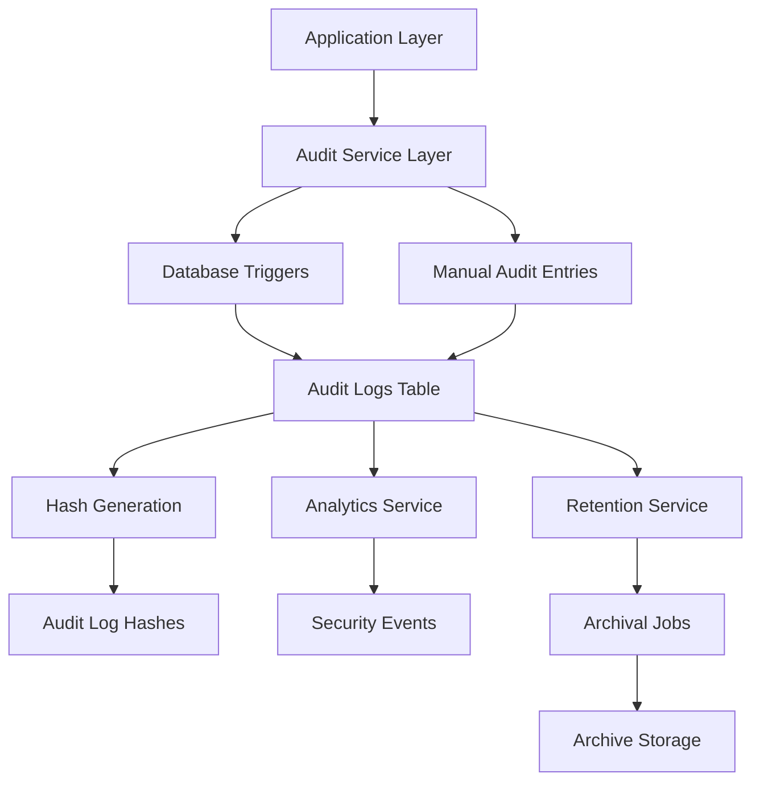

# Audit Log System Documentation

## Table of Contents

1. [Overview](#overview)
2. [Architecture](#architecture)
3. [Data Model](#data-model)
4. [API Reference](#api-reference)
5. [Security Features](#security-features)
6. [Retention and Archival](#retention-and-archival)
7. [User Interface](#user-interface)
8. [Operational Procedures](#operational-procedures)
9. [Compliance](#compliance)
10. [Troubleshooting](#troubleshooting)

## Overview

The Strategic Planning System includes a comprehensive audit logging system that tracks all changes to critical data, providing accountability, security, and compliance capabilities. This system automatically captures data modifications, user activities, and system events with tamper-resistant storage and advanced analytics.

### Key Features

- **Automatic Audit Triggers**: Database triggers capture all changes to critical tables
- **Enhanced Metadata**: Captures IP addresses, user agents, and session information
- **Advanced Analytics**: User activity analysis, security event detection, and reporting
- **Data Integrity**: Hash-based tamper detection and blockchain-like verification
- **Retention Management**: Automated archival and deletion based on configurable policies
- **Export Capabilities**: CSV export and compliance reporting
- **Real-time Monitoring**: Security event detection and alerting

## Architecture

### System Components



### Service Layers

1. **AuditLogService**: Core audit log operations and analytics
2. **AuditSecurityService**: Integrity verification and security monitoring
3. **AuditRetentionService**: Data lifecycle management and archival

## Data Model

### Core Tables

#### audit_logs
Primary audit log storage table.

```sql
CREATE TABLE audit_logs (
    id UUID PRIMARY KEY DEFAULT uuid_generate_v4(),
    table_name TEXT NOT NULL,
    record_id UUID NOT NULL,
    action TEXT NOT NULL,
    old_values JSONB,
    new_values JSONB,
    changed_by UUID REFERENCES users(id) ON DELETE SET NULL,
    changed_at TIMESTAMPTZ DEFAULT NOW(),
    ip_address INET,
    user_agent TEXT,
    CONSTRAINT audit_logs_action_check CHECK (action IN ('insert', 'update', 'delete'))
);
```

#### audit_log_hashes
Tamper-resistant hash storage for integrity verification.

```sql
CREATE TABLE audit_log_hashes (
    id UUID PRIMARY KEY DEFAULT uuid_generate_v4(),
    audit_log_id UUID NOT NULL REFERENCES audit_logs(id) ON DELETE CASCADE,
    hash_value TEXT NOT NULL,
    hash_algorithm TEXT NOT NULL DEFAULT 'sha256',
    previous_hash_value TEXT,
    blockchain_hash TEXT,
    timestamp TIMESTAMPTZ DEFAULT NOW(),
    verified BOOLEAN DEFAULT true
);
```

#### audit_security_events
Security events and anomalies detected in audit logs.

```sql
CREATE TABLE audit_security_events (
    id UUID PRIMARY KEY DEFAULT uuid_generate_v4(),
    type TEXT NOT NULL,
    severity TEXT NOT NULL,
    description TEXT NOT NULL,
    affected_records TEXT[] DEFAULT '{}',
    detected_at TIMESTAMPTZ DEFAULT NOW(),
    user_id UUID REFERENCES users(id),
    ip_address INET,
    metadata JSONB DEFAULT '{}',
    resolved BOOLEAN DEFAULT false,
    resolved_at TIMESTAMPTZ,
    resolved_by UUID REFERENCES users(id)
);
```

#### audit_retention_policies
Data retention and archival policies.

```sql
CREATE TABLE audit_retention_policies (
    id UUID PRIMARY KEY DEFAULT uuid_generate_v4(),
    name TEXT NOT NULL,
    description TEXT,
    retention_period_days INTEGER NOT NULL,
    archive_period_days INTEGER NOT NULL,
    compression_enabled BOOLEAN DEFAULT true,
    encryption_enabled BOOLEAN DEFAULT false,
    applicable_table_names TEXT[] NOT NULL,
    is_active BOOLEAN DEFAULT true,
    created_at TIMESTAMPTZ DEFAULT NOW(),
    updated_at TIMESTAMPTZ DEFAULT NOW()
);
```

#### audit_archival_jobs
Tracking of archival job execution.

```sql
CREATE TABLE audit_archival_jobs (
    id UUID PRIMARY KEY DEFAULT uuid_generate_v4(),
    policy_id UUID NOT NULL REFERENCES audit_retention_policies(id),
    status TEXT NOT NULL DEFAULT 'pending',
    start_time TIMESTAMPTZ NOT NULL,
    end_time TIMESTAMPTZ,
    records_processed INTEGER DEFAULT 0,
    records_archived INTEGER DEFAULT 0,
    records_deleted INTEGER DEFAULT 0,
    archive_location TEXT NOT NULL,
    error_message TEXT
);
```

### Monitored Tables

The following tables have audit triggers enabled:

- `users` - User account changes
- `departments` - Department modifications
- `municipalities` - Municipal settings
- `fiscal_years` - Fiscal year management
- `strategic_plans` - Strategic plan changes
- `strategic_goals` - Goal modifications
- `initiatives` - Initiative updates
- `initiative_budgets` - Budget changes
- `comments` - Comment activity
- `council_goals` - Council goal changes
- `ai_analyses` - AI analysis tracking

## API Reference

### AuditLogService

#### Core Methods

**getAuditLogs(filters: AuditLogFilters): Promise<AuditLogsResponse>**

Retrieve paginated audit logs with filtering and sorting.

```typescript
const auditService = new AuditLogService()
const logs = await auditService.getAuditLogs({
  startDate: '2025-01-01',
  endDate: '2025-01-31',
  action: 'update',
  entityType: 'users',
  page: 1,
  limit: 50
})
```

**createAuditLogEntry(entry: ManualAuditEntry): Promise<void>**

Create manual audit log entries for custom events.

```typescript
await auditService.createAuditLogEntry({
  tableName: 'custom_events',
  recordId: 'event-123',
  action: 'security_event',
  newValues: { event: 'login_attempt', result: 'success' },
  userId: 'user-456',
  ipAddress: '192.168.1.1'
})
```

**getEntityHistory(tableName: string, recordId: string): Promise<AuditLogEntry[]>**

Get complete history for a specific record.

```typescript
const history = await auditService.getEntityHistory('users', 'user-123')
```

**exportAuditLogs(filters: AuditLogFilters): Promise<string>**

Export audit logs as CSV.

```typescript
const csvData = await auditService.exportAuditLogs({
  startDate: '2025-01-01',
  endDate: '2025-01-31'
})
```

#### Analytics Methods

**getDashboardStats(): Promise<DashboardStats>**

Get audit log statistics for dashboard display.

**getUserActivitySummary(limit: number): Promise<UserActivitySummary[]>**

Get user activity analytics.

**generateFieldChanges(oldValues, newValues): FieldChange[]**

Analyze field-level changes between record versions.

### AuditSecurityService

#### Integrity Methods

**verifyRecordIntegrity(auditLogId: string): Promise<IntegrityResult>**

Verify integrity of a single audit log record.

```typescript
const securityService = new AuditSecurityService()
const result = await securityService.verifyRecordIntegrity('log-123')
// result: { valid: boolean, hashExists: boolean, hashMatches: boolean, chainValid: boolean }
```

**verifyBulkIntegrity(limit: number): Promise<IntegrityReport>**

Perform bulk integrity verification.

```typescript
const report = await securityService.verifyBulkIntegrity(1000)
// report: { totalRecords, verifiedRecords, tamperedRecords, integrityScore, ... }
```

**generateHashChain(startDate?, endDate?): Promise<ChainHash>**

Generate immutable hash chain for audit trail.

#### Security Monitoring

**detectAnomalies(): Promise<SecurityEvent[]>**

Detect suspicious patterns in audit logs.

**createSecurityEvent(event: SecurityEventData): Promise<SecurityEvent>**

Create security event record.

**getSecurityEvents(options: SecurityEventFilters): Promise<SecurityEvent[]>**

Retrieve security events with filtering.

### AuditRetentionService

#### Policy Management

**createRetentionPolicy(policy: RetentionPolicyData): Promise<RetentionPolicy>**

Create new data retention policy.

```typescript
const retentionService = new AuditRetentionService()
const policy = await retentionService.createRetentionPolicy({
  name: 'Standard Retention',
  description: 'Standard 7-year retention for compliance',
  retentionPeriodDays: 2555, // 7 years
  archivePeriodDays: 365,    // 1 year before archival
  compressionEnabled: true,
  encryptionEnabled: true,
  applicableTableNames: ['users', 'strategic_plans'],
  isActive: true
})
```

**getRetentionPolicies(): Promise<RetentionPolicy[]>**

Get all retention policies.

**executeArchival(policyId: string, archiveLocation: string): Promise<ArchivalJob>**

Execute archival process.

#### Reporting

**generateRetentionReport(): Promise<RetentionReport>**

Generate data retention status report.

**generateComplianceReport(startDate: string, endDate: string): Promise<ComplianceReport>**

Generate compliance audit report.

## Security Features

### Tamper Detection

1. **Hash Generation**: Each audit log record has a cryptographic hash
2. **Chain Integrity**: Previous hash values create blockchain-like chain
3. **Verification**: Regular integrity checks detect tampering
4. **Alerts**: Automatic security events for integrity violations

### Digital Signatures

```typescript
// Generate signature (simplified example)
const signature = securityService.generateDigitalSignature(auditData, privateKey)

// Verify signature
const result = securityService.verifyDigitalSignature(auditData, signature, publicKey)
```

### Anomaly Detection

Automated detection of:
- Bulk modifications (excessive changes in short time)
- Time anomalies (future timestamps)
- Unauthorized access patterns
- Hash mismatches
- Chain integrity violations

### Access Control

- Only admins and city managers can view audit logs
- Role-based access to different audit log features
- IP address tracking for all audit log access

## Retention and Archival

### Retention Policies

Policies define:
- **Retention Period**: How long data stays in active database
- **Archive Period**: When data moves to long-term storage
- **Compression**: Gzip compression for archived data
- **Encryption**: Encryption of archived files (planned)
- **Table Scope**: Which tables the policy applies to

### Archival Process

1. **Identification**: Find records exceeding archive period
2. **Export**: Save records to JSON files
3. **Compression**: Gzip files if enabled
4. **Verification**: Verify archived data integrity
5. **Cleanup**: Remove old records from active database

### Archive Storage

- Files stored as JSON with timestamps
- Compressed .gz format when enabled
- Organized by table name and date
- Restoration capability for investigations

## User Interface

### Audit Logs Page (`/admin/audit-logs`)

Features:
- Paginated table view of audit logs
- Advanced filtering (date range, user, action, entity)
- Expandable rows showing detailed changes
- Field-by-field diff view
- CSV export functionality

### Audit Analytics Dashboard (`/admin/audit-analytics`)

Provides:
- System activity statistics
- User activity summaries
- Security event monitoring
- Activity trend charts
- Top actions analysis

### Components

- **AuditLogsTable**: Main audit log display with diff views
- **AuditLogsFilters**: Advanced filtering interface
- **AuditLogsDashboard**: Analytics and reporting dashboard
- **AuditLogsDebug**: Debugging and system status

## Operational Procedures

### Daily Operations

1. **Monitor Dashboard**: Check audit analytics for anomalies
2. **Review Security Events**: Address any unresolved security alerts
3. **Verify Backups**: Ensure audit log backups are current

### Weekly Operations

1. **Integrity Check**: Run bulk integrity verification
2. **Review User Activity**: Check user activity summaries
3. **Archive Management**: Review archival job status

### Monthly Operations

1. **Retention Review**: Review and update retention policies
2. **Compliance Report**: Generate monthly compliance reports
3. **Cleanup**: Archive or delete old data per policies

### Emergency Procedures

**Security Breach Response:**
1. Immediately run integrity verification
2. Review recent security events
3. Check for unauthorized access patterns
4. Generate forensic audit trail
5. Document all findings

**Data Recovery:**
1. Identify affected date range
2. Locate archived data files
3. Use `restoreArchivedData()` method
4. Verify data integrity after restoration
5. Update audit trail

### Maintenance Commands

```bash
# Run integrity check
npm run audit:integrity-check

# Execute archival
npm run audit:archive

# Generate compliance report
npm run audit:compliance-report

# Export audit logs
npm run audit:export -- --start-date=2025-01-01 --end-date=2025-01-31
```

## Compliance

### Regulatory Requirements

The audit log system supports compliance with:
- **SOX (Sarbanes-Oxley)**: Financial data change tracking
- **GDPR**: Data processing activity logs
- **HIPAA**: Healthcare data access logs (if applicable)
- **State/Local**: Municipal compliance requirements

### Audit Trail Requirements

Ensures:
- **Non-repudiation**: Digital signatures prevent denial
- **Completeness**: All changes captured automatically
- **Integrity**: Tamper detection and hash verification
- **Availability**: Reliable access and backup procedures
- **Confidentiality**: Role-based access controls

### Compliance Reports

Generate reports showing:
- Complete audit trail for specified periods
- User activity summaries
- Data retention compliance status
- Security event resolutions
- System integrity verification results

## Troubleshooting

### Common Issues

**No Audit Logs Appearing**
1. Check if audit triggers are enabled
2. Verify user has admin/city_manager role
3. Check database connectivity
4. Review browser console for errors

**Integrity Verification Failures**
1. Run individual record verification
2. Check for database corruption
3. Verify hash generation algorithm
4. Review security event logs

**Performance Issues**
1. Check audit_logs table size
2. Review index usage
3. Consider archival of old records
4. Optimize query filters

**Export Failures**
1. Check file system permissions
2. Verify available disk space
3. Review export filter parameters
4. Check for timeout issues

### Debugging Tools

**AuditLogsDebug Component**
- Shows authentication status
- Displays user permissions
- Verifies table access
- Shows record counts

**Database Queries**
```sql
-- Check recent audit activity
SELECT COUNT(*), action, table_name
FROM audit_logs 
WHERE changed_at > NOW() - INTERVAL '24 hours'
GROUP BY action, table_name;

-- Verify hash integrity
SELECT al.id, al.changed_at, ah.verified
FROM audit_logs al
LEFT JOIN audit_log_hashes ah ON al.id = ah.audit_log_id
WHERE ah.verified = false OR ah.id IS NULL;

-- Check security events
SELECT type, severity, COUNT(*)
FROM audit_security_events
WHERE detected_at > NOW() - INTERVAL '7 days'
GROUP BY type, severity;
```

### Performance Monitoring

Key metrics to monitor:
- Audit log creation rate
- Query response times
- Storage space usage
- Integrity check duration
- Security event frequency

### Log Analysis

Use these queries for troubleshooting:

```sql
-- Most active users
SELECT u.full_name, COUNT(*) as activity_count
FROM audit_logs al
JOIN users u ON al.changed_by = u.id
WHERE al.changed_at > NOW() - INTERVAL '7 days'
GROUP BY u.full_name
ORDER BY activity_count DESC;

-- Table modification frequency
SELECT table_name, COUNT(*) as change_count
FROM audit_logs
WHERE changed_at > NOW() - INTERVAL '24 hours'
GROUP BY table_name
ORDER BY change_count DESC;

-- Failed integrity checks
SELECT COUNT(*) as failed_count
FROM audit_log_hashes
WHERE verified = false;
```

---

## Support and Contact

For technical support or questions about the audit log system:

1. Check this documentation first
2. Review the troubleshooting section
3. Check system logs and debug output
4. Contact system administrators

**Version**: 2.0.0  
**Last Updated**: January 2025  
**Maintained By**: System Development Team